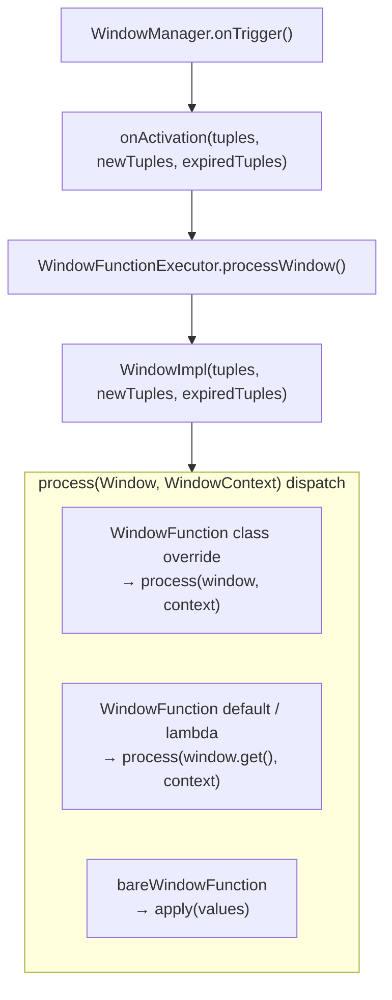

# PIP-484: Expose `Window` Interface for WindowFunction Processing

# Background knowledge

## Pulsar Window Functions

Pulsar Window Functions are a specialized form of Pulsar Function that group incoming messages into windows based on time or message count, and invoke the user function with a batch of messages each time a window fires.

Window types:

- **Tumbling window**: adjacent windows do not overlap; each message belongs to exactly one window.
- **Sliding window**: adjacent windows may overlap; a message can belong to multiple windows.

Time semantics:

- **Processing time**: windows are driven by the clock at which messages enter the system.
- **Event time**: windows are driven by timestamps embedded in messages, with watermarks used to track event-time progress.

## Existing public API

```
pulsar-functions/api-java
└── org.apache.pulsar.functions.api
    ├── WindowFunction<X, T>        // user-implemented window function interface
    └── WindowContext               // context interface for window functions
```

`WindowFunction` signature:

```java
@FunctionalInterface
public interface WindowFunction<X, T> {
    T process(Collection<Record<X>> input, WindowContext context) throws Exception;
}
```

On each trigger, the user function receives a `Collection<Record<X>>` containing **all messages in the current window**.

## Internal runtime pipeline

```
pulsar-functions/instance
└── org.apache.pulsar.functions.windowing
    ├── Window<T>                   // window view interface (internal package today; removed in Change 1)
    ├── WindowImpl<T>               // Window implementation holding three event lists
    ├── WindowManager<T>            // window manager; classifies events
    ├── WindowFunctionExecutor<X,T> // executor bridging runtime and user function (X=input, T=output)
    ├── WindowLifecycleListener<T>  // window lifecycle callbacks
    ├── EvictionPolicy<T>           // eviction policy (decides when events expire)
    └── TriggerPolicy<T>            // trigger policy (decides when to fire a window)
```

Today, `WindowImpl` implements an internal `org.apache.pulsar.functions.windowing.Window<T>` interface that already exposes incremental views (this PIP promotes that interface to `org.apache.pulsar.functions.api.Window` and deletes the internal copy):

```java
public interface Window<T> {
    List<T> get();             // all events in the current window
    List<T> getNew();          // events added since the last trigger
    List<T> getExpired();      // events removed since the last trigger
    Long getStartTimestamp();  // window start timestamp
    Long getEndTimestamp();    // window end timestamp (reference time)
}
```

# Motivation

## Problem: `getNew()` / `getExpired()` data is discarded at the public API layer

`WindowManager.onTrigger()` already classifies events into three categories on every window activation:

| Category | Meaning |
|----------|---------|
| `tuples` | all events currently in the window |
| `newTuples` | events newly added since the last trigger |
| `expiredTuples` | events removed since the last trigger |

These three lists are passed into `WindowImpl` and delivered to the executor via `WindowLifecycleListener.onActivation()`. However, `WindowFunctionExecutor.process(Window, WindowContext)` only passes `inputWindow.get()` to the user function; newly added and expired events are discarded:

```java
// WindowFunctionExecutor.java (current implementation; type parameters renamed <T,X> → <X,T> in Change 3)
public T process(Window<Record<X>> inputWindow, WindowContext context) throws Exception {
    // ...
    return this.windowFunction.process(inputWindow.get(), context); // full window only; getNew()/getExpired() dropped
}
```

## Impact

Users cannot perform efficient incremental computation. Typical affected scenarios:

1. **Incremental aggregation** (sliding-window statistics): on each trigger most messages in the window are unchanged; re-scanning the full collection is wasteful.
2. **State maintenance**: when external state must track which messages entered or left the window, users must diff full collections manually — inefficient and error-prone.
3. **Expired-event handling**: side effects such as resource release or counter decrements when messages leave the window.

# Goals

## In Scope

- Expose the `Window<T>` interface in the public API (including `getNew()`, `getExpired()`, and timestamp methods), with explicit Javadoc for **object lifetime** (valid only during `process()`) and **list mutability** (read-only snapshots; callers must not modify returned lists).
- Remove the internal `org.apache.pulsar.functions.windowing.Window` type and update all instance-module references to `org.apache.pulsar.functions.api.Window`.
- Add a new `default` overload to the existing public `WindowFunction<X, T>` interface so class-based implementations can receive the full `Window<Record<X>>` view.
- Have `WindowFunctionExecutor` call the new `WindowFunction` overload without requiring configuration or deployment changes.
- Preserve all existing behavior for current `WindowFunction` users.

## Out of Scope

- Incremental support for `java.util.function.Function` (bare window functions).
- Equivalent capability for Python / Go Functions.
- Changes to window state snapshot / checkpoint mechanisms.

# High Level Design

Extend the existing public `WindowFunction<X, T>` interface with a new `default` `process` overload that accepts `Window<Record<X>>` instead of only `Collection<Record<X>>`, giving class-based implementations access to:

- `window.get()` — all messages in the current window
- `window.getNew()` — messages added since the last trigger
- `window.getExpired()` — messages removed since the last trigger
- `window.getStartTimestamp()` / `window.getEndTimestamp()` — window time boundaries

The new overload is a default method that delegates to the existing abstract `process(Collection<Record<X>>, WindowContext)` method:

```java
default T process(Window<Record<X>> window, WindowContext context) throws Exception {
    return process(window.get(), context);
}
```

This keeps `WindowFunction` a valid `@FunctionalInterface`. Existing lambdas bind to the abstract collection-based method and keep today's behavior.

`WindowFunctionExecutor` always calls `process(Window<Record<X>>, WindowContext)`. The default overload delegates to `process(window.get(), context)` unless a class overrides the window overload.

### Design tradeoff

- **Lambdas cannot access incremental views** — they cannot override the default `process(Window, …)` method, so `getNew()` / `getExpired()` require a class-based implementation.
- **Class override is the runtime entry point** — when a class overrides `process(Window, …)`, the runtime does not invoke any `process(Collection, …)` override unless the window overload delegates to it explicitly.

Data flow (after the change):



# Detailed Design

## Design & Implementation Details

### Change 1: Move `Window<T>` to `api-java`

**Current path**: `pulsar-functions/instance/src/main/java/org/apache/pulsar/functions/windowing/Window.java`

**New path**: `pulsar-functions/api-java/src/main/java/org/apache/pulsar/functions/api/Window.java`

The interface methods are unchanged in signature; the package moves to the public API module :

```java
// pulsar-functions/api-java/.../api/Window.java
@InterfaceAudience.Public
@InterfaceStability.Stable
/**
 * A per-trigger view of events in a window.
 * <p>
 * A {@code Window} instance is valid only for the duration of the
 * {@link WindowFunction#process(Window, WindowContext)} call
 * in which it is passed. Callers must not retain it across triggers.
 * </p>
 */
public interface Window<T> {
    /**
     * All events in the current window for this activation.
     * <p>
     * The returned list is a snapshot for the current {@code process()} invocation only.
     * Callers must not modify it.
     * </p>
     */
    List<T> get();

    /**
     * Events added to the window since the previous trigger.
     * <p>
     * The returned list is a snapshot for the current {@code process()} invocation only.
     * Callers must not modify it.
     * </p>
     */
    List<T> getNew();

    /**
     * Events removed from the window since the previous trigger.
     * <p>
     * The returned list is a snapshot for the current {@code process()} invocation only.
     * Callers must not modify it.
     * </p>
     */
    List<T> getExpired();

    /**
     * The window end timestamp for this activation.
     * <p>
     * Populated by {@code WindowFunctionExecutor} when it constructs the
     * {@code WindowImpl} for each trigger — {@code WindowImpl} stores the value
     * as supplied; it does not derive timestamps itself. For event-time windows,
     * this is the reference time from the trigger policy (watermark-based). For
     * processing-time windows, this is the processing-time reference from the
     * trigger policy. Returns {@code null} if the trigger provides no reference
     * timestamp.
     * </p>
     */
    Long getEndTimestamp();

    /**
     * The window start timestamp for this activation.
     * <p>
     * Populated by {@code WindowFunctionExecutor} when it constructs the
     * {@code WindowImpl} for each trigger. When a time-based window length
     * ({@code windowLengthDurationMs}) is configured, the executor sets this to
     * {@code getEndTimestamp() - windowLengthDurationMs}. Returns {@code null}
     * for count-based windows (no time-based window length) or when
     * {@link #getEndTimestamp()} is {@code null}.
     * </p>
     * <p>
     * For sliding windows, start/end bound the <em>current activation's</em>
     * window interval (window length), not the sliding step size
     * ({@code slidingInterval*}).
     * </p>
     */
    Long getStartTimestamp();
}
```

**Migration of `org.apache.pulsar.functions.windowing.Window`**

Delete the internal interface file. `WindowImpl` implements `org.apache.pulsar.functions.api.Window` directly, and every reference in `pulsar-functions/instance` is updated to import the public type:

| File | Change |
|------|--------|
| `api-java/.../api/Window.java` | **Added** — canonical public interface (Javadoc, lifetime/mutability contracts) |
| `windowing/Window.java` | **Removed** |
| `windowing/WindowImpl.java` | `implements org.apache.pulsar.functions.api.Window<T>` |
| `windowing/WindowFunctionExecutor.java` | import `org.apache.pulsar.functions.api.Window` |
| `windowing/WindowFunctionExecutorTest.java` | import `org.apache.pulsar.functions.api.Window` |

The old FQCN was never part of the supported public Functions API. Within this repository, only the files above referenced it; all are migrated to `org.apache.pulsar.functions.api.Window`. No deprecated shim is shipped in Apache Pulsar itself.

**Optional compatibility note (forks / downstream only)**

If code outside this repository still imports `org.apache.pulsar.functions.windowing.Window` and a straight import change is impractical, a downstream fork may reintroduce a same-named subtype at the original path — an empty interface that extends the public API:

```java
// Optional; not part of the Apache Pulsar change set
package org.apache.pulsar.functions.windowing;

/** @deprecated Use {@link org.apache.pulsar.functions.api.Window}. */
@Deprecated
public interface Window<T> extends org.apache.pulsar.functions.api.Window<T> {
}
```

This preserves source compatibility for callers of the old FQCN without adding methods or duplicating Javadoc. It is a **local fork decision**, not the approach taken in the main codebase. New user code must use `org.apache.pulsar.functions.api.Window`.

Implementation note: `WindowImpl` continues to return the same mutable `ArrayList` instances it holds; the public contract treats them as read-only snapshots. No `Collections.unmodifiableList` wrapper is added in this change — callers are forbidden from modifying the lists by Javadoc, not by enforcement at runtime.

### Change 2: Add a `Window<Record<X>>` default overload to `WindowFunction<X, T>`

**Path**: `pulsar-functions/api-java/src/main/java/org/apache/pulsar/functions/api/WindowFunction.java`

```java
@InterfaceAudience.Public
@InterfaceStability.Stable
@FunctionalInterface
public interface WindowFunction<X, T> {
    /**
     * Process all records in the triggered window.
     *
     * <p>This remains the single abstract method of the interface, so existing
     * lambda implementations and class implementations continue to work without
     * source changes.</p>
     *
     * @param input   all current records in the window
     * @param context the window function context
     * @return the output, or {@code null} to suppress output
     */
    T process(Collection<Record<X>> input, WindowContext context) throws Exception;

    /**
     * Process the triggered window with access to incremental window views.
     *
     * <p>The default implementation preserves existing behavior by delegating to
     * {@link #process(Collection, WindowContext)} with {@link Window#get()}.</p>
     *
     * <p>Class-based implementations can override this method to access newly
     * added events ({@link Window#getNew()}) and expired events
     * ({@link Window#getExpired()}). Lambda implementations cannot override a
     * default method and therefore keep the collection-based behavior.</p>
     *
     * @param window  the window view for this activation, valid only for the
     *                duration of this method call. Callers must not retain the
     *                {@code Window} reference or any list returned by its getters
     *                across invocations.
     * @param context     the window function context
     * @return the output, or {@code null} to suppress output
     */
    default T process(Window<Record<X>> window, WindowContext context) throws Exception {
        return process(window.get(), context);
    }
}
```

Because the new method is `default`, adding it is source-compatible and binary-compatible for existing `WindowFunction` implementations.

#### Example: sliding-window sum

Both overloads are shown below. The runtime invokes only `process(Window, …)`; the `process(Collection, …)` override is **not called** unless the window overload delegates to it explicitly (for example `return process(window.get(), context)`). Running sum is held in an instance field (not checkpointed across restarts).

```java
/**
 * Maintains the sum of integer values in the current sliding window incrementally.
 */
public class SlidingWindowSumFunction implements WindowFunction<Integer, Integer> {

    private long runningSum;

    @Override
    public Integer process(Collection<Record<Integer>> input, WindowContext context) {
        // Not invoked at runtime when process(Window, …) is overridden.
        // Kept for shared logic or explicit delegation from the window overload.
        return input.stream().mapToInt(Record::getValue).sum();
    }

    @Override
    public Integer process(Window<Record<Integer>> window, WindowContext context) throws Exception {
        for (Record<Integer> record : window.getNew()) {
            runningSum += record.getValue();
        }
        for (Record<Integer> record : window.getExpired()) {
            runningSum -= record.getValue();
        }
        return (int) runningSum;
    }
}
```

### Change 3: Update `WindowFunctionExecutor`

**Path**: `pulsar-functions/instance/src/main/java/org/apache/pulsar/functions/windowing/WindowFunctionExecutor.java`

No new field or user-function detection path is needed. `initializeUserFunction()` continues to accept `WindowFunction` exactly as it does today.

Update `process(Window<Record<X>>, WindowContext)` to pass the full window view to `WindowFunction` (see **Design tradeoff** above).

```java
public T process(Window<Record<X>> inputWindow, WindowContext context) throws Exception {
    if (this.bareWindowFunction != null) {
        Collection<X> values = inputWindow.get().stream()
                .map(Record::getValue).collect(Collectors.toList());
        return this.bareWindowFunction.apply(values);
    } else {
        // Pass the full Window view. The WindowFunction default method preserves
        // existing collection-based behavior unless a class overrides it.
        return this.windowFunction.process(inputWindow, context);
    }
}
```

## Public-facing Changes

### Public API

#### New interface: `org.apache.pulsar.functions.api.Window<T>`

Promoted from the internal package. The internal `org.apache.pulsar.functions.windowing.Window` type is removed (see Change 1); instance code imports the public interface directly.

| Method | Description |
|--------|-------------|
| `List<T> get()` | All events in the current window. Returns a mutable list that is a **read-only snapshot** for this activation; callers must not modify it or retain it past `process()`. |
| `List<T> getNew()` | Events added since the last trigger. Same lifetime and mutability contract as `get()`. |
| `List<T> getExpired()` | Events removed since the last trigger. Same lifetime and mutability contract as `get()`. |
| `Long getStartTimestamp()` | Window start time for this activation. Set by `WindowFunctionExecutor` to `getEndTimestamp() - windowLengthDurationMs` when a time-based window length is configured; `null` for count-based windows or when `getEndTimestamp()` is `null`. For sliding windows, this bounds the current activation's window interval (window length), not the sliding step. |
| `Long getEndTimestamp()` | Window end time for this activation. Set by `WindowFunctionExecutor` from the trigger policy's reference time (watermark-based for event-time, processing-time for processing-time). `WindowImpl` stores the value as supplied; returns `null` if the trigger provides no reference timestamp. |

#### API contracts (`Window` lifetime and list mutability)

On each window trigger, `WindowFunctionExecutor` builds a new `WindowImpl` with freshly collected lists, injects `getEndTimestamp()` from the trigger's reference time and `getStartTimestamp()` from `referenceTime - windowLengthDurationMs` (when applicable), and passes the view to `WindowFunction.process(Window<Record<X>>, WindowContext)`. The runtime does not retain that object after `process()` returns.

| Contract | Rule |
|----------|------|
| **`Window` lifetime** | The `inputWindow` argument is valid **only for the duration of a single `process()` call**. Implementations must not store the `Window` reference (or any list obtained from it) in a field, cache, or closure for use on a later trigger. Each activation receives a new `Window` instance. |
| **List mutability** | `get()`, `getNew()`, and `getExpired()` return mutable `List` instances that are **snapshots for the current activation**. Callers **must not modify** them. Mutations do not update the runtime's live window state (the lists are copies), but modification is unsupported and must not be relied upon. Javadoc on each getter states this explicitly. |

These contracts mirror how `WindowFunction` already treats `Collection<Record<X>>` from `inputWindow.get()`: a per-trigger view, not durable user-owned state.

#### Updated interface: `org.apache.pulsar.functions.api.WindowFunction<X, T>`

The existing public interface gains a new default overload.

| Method | Description |
|--------|-------------|
| `T process(Collection<Record<X>> input, WindowContext context)` | Existing abstract method. Existing implementations and lambdas continue to target this method. |
| `default T process(Window<Record<X>> window, WindowContext context)` | New default method. Delegates to `process(window.get(), context)` unless a class override provides incremental access (see **Design tradeoff**). |

### Configuration

No new `WindowConfig` fields or CLI options. Existing window settings (`windowLength*`, `slidingInterval*`, event-time options, etc.) apply unchanged.

No submit-time validation change is required because users still implement `WindowFunction`, which is already accepted by `FunctionConfigUtils.doJavaChecks()` and `FunctionCommon.getFunctionClassParent()`.


# Monitoring

No new metrics are introduced by this change. Window triggering, classification of events (`get()`, `getNew()`, `getExpired()`), and ack/publish behavior remain unchanged; the PIP only exposes existing per-activation window views through the public Java API.


# Security Considerations

This proposal adds a public Java API for Functions window processing only. It introduces no new REST endpoints, wire-protocol commands, authentication/authorization checks, or multi-tenancy behavior. The exposed `Window` contents are limited to records already delivered to the user function by the existing window runtime.


# Alternatives

## Alternative 1: Add a new `IncrementalWindowFunction<X, T>` interface

An earlier design introduced a new public interface:

```java
@FunctionalInterface
public interface IncrementalWindowFunction<X, T> {
    T process(Window<Record<X>> window, WindowContext context) throws Exception;
}
```

`WindowFunctionExecutor` would detect whether the user function implements `IncrementalWindowFunction` and dispatch to it before falling back to the existing `WindowFunction` path.

Although the interface name is `IncrementalWindowFunction`, it also exposes **expired** events (via `Window#getExpired()`), since incremental window state updates may depend on both arrivals and evictions from the window.

**Advantages**

- Gives the incremental API a distinct type name, making user intent explicit at the class declaration.

**Disadvantages**

- Adds another public user-function interface for a behavior that is still semantically a window function, increasing API surface area.
- Requires additional submit-time validation and type-inference changes.
- If a user class implements multiple recognized interfaces (for example both `IncrementalWindowFunction` and `WindowFunction`), the runtime must define and document a dispatch precedence order. That ordering becomes an observable behavior contract and can surprise users.

The selected design avoids those costs by extending the existing `WindowFunction` interface with a default overload. Existing validation and type inference continue to work because users still implement `WindowFunction`. Existing lambdas remain collection-based because they cannot override default methods, while class-based implementations can opt into incremental data by overriding `process(Window<Record<X>>, WindowContext)`.

## Alternative 2: Expose `Window` via `WindowContext`

Another option is to keep the existing `WindowFunction` signature unchanged and add a getter on `WindowContext`:

```java
public interface WindowContext extends BaseContext {
    // existing methods unchanged ...

    /**
     * The window view for the current activation.
     * Valid only for the duration of the enclosing {@code process()} call.
     */
    Window<Record<?>> getWindow();
}
```

Users would continue to implement `process(Collection<Record<X>> input, WindowContext context)` and access incremental data through the context:

```java
@Override
public Integer process(Collection<Record<Integer>> input, WindowContext context) throws Exception {
    Window<Record<Integer>> window = (Window) context.getWindow();
    for (Record<Integer> record : window.getNew()) { /* ... */ }
    return aggregate(input);
}
```

`WindowFunctionExecutor` would attach the current `WindowImpl` to `WindowContextImpl` before calling `process()`.

**Advantages**

- No change to the `WindowFunction` method signature; existing lambdas and compiled user code remain fully compatible.
- Lambdas can access incremental data without converting to a class (they can call `context.getWindow()` inside the lambda body).
- Single runtime entry point — no ambiguity between two `process` overloads.
- Simpler executor dispatch: always call `process(inputWindow.get(), context)`; no default-method or class-loader concerns.

**Disadvantages**

- **Redundant inputs**: the `input` parameter is effectively `getWindow().get()`. Users must choose which source to trust, and the API must guarantee they stay in sync for the lifetime of the call.
- **Weaker typing**: `WindowContext` cannot be generically parameterized by `X`, so `getWindow()` would return `Window<Record<?>>` (or require an unchecked cast), unlike `Window<Record<X>>` on the `process` parameter.
- **Lower discoverability**: incremental access is hidden behind a context getter rather than expressed in the method signature.
- **Higher lifetime risk**: developers often store or pass `Context` objects to helpers or async callbacks; attaching a per-trigger `Window` to context makes it easier to accidentally retain window state across triggers.

The selected design treats the window view as **input data** and passes it explicitly via a `process(Window, WindowContext)` parameter. That keeps lifetime and mutability contracts on the parameter (where Java users expect them), avoids the `input` / `getWindow().get()` duplication, and preserves full generic typing on `Window<Record<X>>`.


# Backward & Forward Compatibility

## Existing `WindowFunction` users

**Fully backward compatible.** The `WindowFunctionExecutor.initializeUserFunction()` detection path for `WindowFunction` is unchanged. Existing class implementations use the new default method, which delegates to the existing collection-based method. Existing lambda implementations also continue to implement the collection-based abstract method because lambdas cannot override default methods. Class implementations that override both methods use the `Window<Record<X>>` overload as the runtime entry point.

## Function class loader compatibility

The Java Functions runtime uses `FunctionClassLoaders.ParentFirstClassLoader`, which loads classes from the parent classloader before loading classes from the user package. As a result, `org.apache.pulsar.functions.api.WindowFunction` is loaded from the Pulsar Functions runtime/API provided by the worker, not from a copy bundled inside the user's function package.

This matters for compatibility with the new default method:

- Existing user packages compiled against the old `WindowFunction` continue to link against the worker-provided `WindowFunction` after upgrade. The worker-provided interface contains the new default overload, so `WindowFunctionExecutor` can call `process(Window<Record<X>>, WindowContext)` and the default method delegates to the user's existing collection-based implementation.
- If a user package accidentally includes an older `org.apache.pulsar.functions.api.WindowFunction.class`, that copy is not used by the standard Java Functions runtime because of parent-first loading. It therefore does not mask the worker's newer interface or remove the default method at runtime.
- A function compiled against the new overload still requires a worker version that provides the public `org.apache.pulsar.functions.api.Window` type and the updated `WindowFunction` interface. Bundling a newer API jar in the function package is not a supported way to run this feature on an older worker, because the worker's parent-loaded API classes take precedence.

## Internal `org.apache.pulsar.functions.windowing.Window` references

The internal interface is **deleted** in Apache Pulsar (see Change 1). Within this repository, `WindowImpl`, `WindowFunctionExecutor`, and `WindowFunctionExecutorTest` are updated to import `org.apache.pulsar.functions.api.Window`. No binary or source compatibility shim is provided in the main codebase.

Downstream forks that still reference the old FQCN may optionally add a same-named `extends org.apache.pulsar.functions.api.Window<T>` interface at the original path (see the optional note in Change 1); that path is not part of this PIP's implementation scope.

## Upgrade

No special steps required. After upgrading to a Pulsar version that includes this feature, the new `WindowFunction` default overload and public `Window` interface are available immediately.

## Downgrade / Rollback

To roll back to a version without this feature:

- User functions that override `WindowFunction.process(Window<Record<X>>, WindowContext)` must remove that override and place their logic in the existing collection-based `process(Collection<Record<X>>, WindowContext)` method, replacing `getNew()` / `getExpired()` logic with manual diffing over the full message collection, before they can be deployed on the older version.

## Pulsar Geo-Replication Upgrade & Downgrade/Rollback Considerations

There is no wire-protocol change between Functions Workers. No special geo-replication considerations apply.

# General Notes

- The runtime already tracks `getNew()` and `getExpired()` on every successful window activation; this PIP exposes that existing behavior through the public API rather than adding new windowing logic.
- **Sliding vs tumbling**: incremental views are most useful for sliding windows; for tumbling windows, `getNew()` is typically equivalent to `get()`.
- Intended test coverage: extend `WindowFunctionExecutorTest` to verify (1) delegation of the default `process(Window, ...)` overload to `process(Collection, ...)` for lambdas and (2) correct invocation of the overridden `process(Window, ...)` path for class-based implementations (including visibility of `getNew()` / `getExpired()` within the call).

# Links

* Mailing List discussion thread: https://lists.apache.org/thread/gwfpt27j57vkfgcscrj7yyfn0jdg1oq4
* Mailing List voting thread: TBD
* Related: [PIP-15: Pulsar Functions](pip-15.md)
* Related: [PIP-396: Align WindowFunction's WindowContext with BaseContext](pip-396.md)
