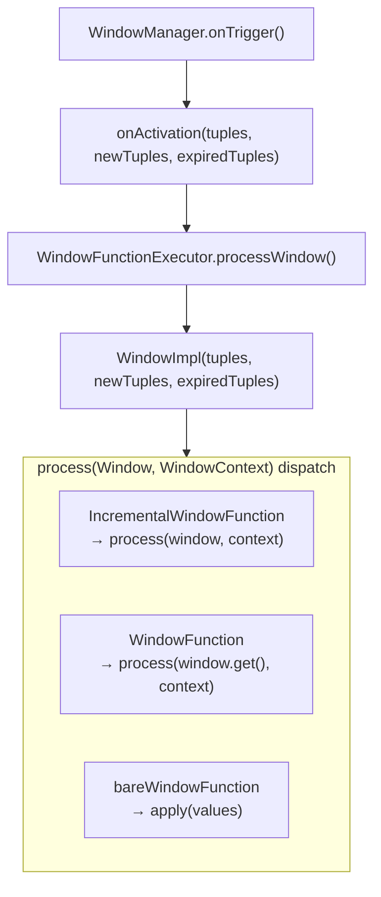

# PIP-484: Expose Incremental Window Events via IncrementalWindowFunction

# Background knowledge

## Pulsar Window Functions

Pulsar Window Functions are a specialized form of Pulsar Function that group incoming messages into windows based on time or message count, and invoke the user function with a batch of messages each time a window fires.

Window types:

- **Tumbling window**: adjacent windows do not overlap; each message belongs to exactly one window.
- **Sliding window**: adjacent windows may overlap; a message can belong to multiple windows.

Time semantics:

- **Processing time**: windows are driven by the clock at which messages enter the system.
- **Event time**: windows are driven by timestamps embedded in messages, with watermarks used to track event-time progress.

## Existing public API

```
pulsar-functions/api-java
└── org.apache.pulsar.functions.api
    ├── WindowFunction<X, T>        // user-implemented window function interface
    └── WindowContext               // context interface for window functions
```

`WindowFunction` signature:

```java
@FunctionalInterface
public interface WindowFunction<X, T> {
    T process(Collection<Record<X>> input, WindowContext context) throws Exception;
}
```

On each trigger, the user function receives a `Collection<Record<X>>` containing **all messages in the current window**.

## Internal runtime pipeline

```
pulsar-functions/instance
└── org.apache.pulsar.functions.windowing
    ├── Window<T>                   // window view interface (internal package today)
    ├── WindowImpl<T>               // Window implementation holding three event lists
    ├── WindowManager<T>            // window manager; classifies events
    ├── WindowFunctionExecutor<T,X> // executor bridging runtime and user function
    ├── WindowLifecycleListener<T>  // window lifecycle callbacks
    ├── EvictionPolicy<T>           // eviction policy (decides when events expire)
    └── TriggerPolicy<T>            // trigger policy (decides when to fire a window)
```

The internal `Window<T>` interface already exposes incremental views:

```java
public interface Window<T> {
    List<T> get();             // all events in the current window
    List<T> getNew();          // events added since the last trigger
    List<T> getExpired();      // events removed since the last trigger
    Long getStartTimestamp();  // window start timestamp
    Long getEndTimestamp();    // window end timestamp (reference time)
}
```

# Motivation

## Problem: `getNew()` / `getExpired()` data is discarded at the public API layer

`WindowManager.onTrigger()` already classifies events into three categories on every window activation:

| Category | Meaning |
|----------|---------|
| `tuples` | all events currently in the window |
| `newTuples` | events newly added since the last trigger |
| `expiredTuples` | events removed since the last trigger |

These three lists are passed into `WindowImpl` and delivered to the executor via `WindowLifecycleListener.onActivation()`. However, `WindowFunctionExecutor.process(Window, WindowContext)` only passes `inputWindow.get()` to the user function; newly added and expired events are discarded:

```java
// WindowFunctionExecutor.java (current implementation)
public X process(Window<Record<T>> inputWindow, WindowContext context) throws Exception {
    // ...
    return this.windowFunction.process(inputWindow.get(), context); // full window only; getNew()/getExpired() dropped
}
```

## Impact

Users cannot perform efficient incremental computation. Typical affected scenarios:

1. **Incremental aggregation** (sliding-window statistics): on each trigger most messages in the window are unchanged; re-scanning the full collection is wasteful.
2. **State maintenance**: when external state must track which messages entered or left the window, users must diff full collections manually — inefficient and error-prone.
3. **Expired-event handling**: side effects such as resource release or counter decrements when messages leave the window.

# Goals

## In Scope

- Expose the `Window<T>` interface in the public API (including `getNew()`, `getExpired()`, and timestamp methods).
- Add a new public `IncrementalWindowFunction<X, T>` interface so users can receive the full `Window<Record<X>>` view.
- Have `WindowFunctionExecutor` transparently support the new interface without requiring configuration or deployment changes.
- Update Functions deployment validation (`FunctionConfigUtils.doJavaChecks`) so `IncrementalWindowFunction` implementations pass the same Java class checks as `WindowFunction`.
- Preserve all existing behavior for current `WindowFunction` users.

## Out of Scope

- Incremental support for `java.util.function.Function` (bare window functions).
- Equivalent capability for Python / Go Functions.
- Changes to window state snapshot / checkpoint mechanisms.

# High Level Design

Introduce a new public interface `IncrementalWindowFunction<X, T>` whose `process` method accepts `Window<Record<X>>` instead of `Collection<Record<X>>`, giving users access to:

- `window.get()` — all messages in the current window
- `window.getNew()` — messages added since the last trigger
- `window.getExpired()` — messages removed since the last trigger
- `window.getStartTimestamp()` / `window.getEndTimestamp()` — window time boundaries

`WindowFunctionExecutor` detects at initialization whether the user class implements `IncrementalWindowFunction`. If so, it passes the `Window` object directly; otherwise it follows the existing code path.

Data flow (after the change):



# Detailed Design

## Design & Implementation Details

### Change 1: Move `Window<T>` to `api-java`

**Current path**: `pulsar-functions/instance/src/main/java/org/apache/pulsar/functions/windowing/Window.java`

**New path**: `pulsar-functions/api-java/src/main/java/org/apache/pulsar/functions/api/Window.java`

The interface methods remain unchanged; only the package declaration and license header are updated:

```java
// pulsar-functions/api-java/.../api/Window.java
public interface Window<T> {
    List<T> get();
    List<T> getNew();
    List<T> getExpired();
    Long getEndTimestamp();
    Long getStartTimestamp();
}
```

The existing internal `Window.java` is replaced by a reference to the `api-java` interface (or removed entirely, with `WindowImpl` implementing the new public interface directly).

### Change 2: Add `IncrementalWindowFunction<X, T>` interface

**Path**: `pulsar-functions/api-java/src/main/java/org/apache/pulsar/functions/api/IncrementalWindowFunction.java`

```java
@FunctionalInterface
public interface IncrementalWindowFunction<X, T> {
    /**
     * Process the triggered window.
     *
     * @param inputWindow the window view for this activation, providing access to
     *                    all current events ({@link Window#get()}),
     *                    newly added events ({@link Window#getNew()}), and
     *                    expired events ({@link Window#getExpired()}).
     * @param context     the window function context
     * @return the output, or {@code null} to suppress output
     */
    T process(Window<Record<X>> inputWindow, WindowContext context) throws Exception;
}
```

#### Example: sliding-window sum

```java
/**
 * Maintains the sum of integer values in the current sliding window incrementally.
 */
public class SlidingWindowSumFunction implements IncrementalWindowFunction<Integer, Integer> {

    private static final String RUNNING_SUM_KEY = "running-sum";

    @Override
    public Integer process(Window<Record<Integer>> window, WindowContext context) throws Exception {
        long newEventsSum = 0;
        for (Record<Integer> record : window.getNew()) {
            newEventsSum += record.getValue();
        }
        long expiredSum = 0;
        for (Record<Integer> record : window.getExpired()) {
            expiredSum += record.getValue();
        }
        long netDelta = newEventsSum - expiredSum;
        if (netDelta != 0) {
            context.incrCounter(RUNNING_SUM_KEY, netDelta);
        }
        return (int) context.getCounter(RUNNING_SUM_KEY);
    }
}
```

### Change 3: Update `WindowFunctionExecutor`

**Path**: `pulsar-functions/instance/src/main/java/org/apache/pulsar/functions/windowing/WindowFunctionExecutor.java`

#### 3a. Add field

```java
protected IncrementalWindowFunction<T, X> incrementalWindowFunction;
```

#### 3b. Extend `initializeUserFunction()`

Detect `IncrementalWindowFunction` via `instanceof` in `initializeUserFunction()`, following the same pattern used for `WindowFunction` today:

```java
@SuppressWarnings("unchecked")
private void initializeUserFunction(WindowConfig windowConfig) {
    // ...
    if (userClassObject instanceof java.util.function.Function) {
        // existing logic, unchanged
        bareWindowFunction = ...;
    } else if (userClassObject instanceof IncrementalWindowFunction) {
        incrementalWindowFunction = (IncrementalWindowFunction<T, X>) userClassObject;
    } else if (userClassObject instanceof WindowFunction) {
        // existing logic, unchanged
        windowFunction = (WindowFunction<T, X>) userClassObject;
    } else {
        throw new IllegalArgumentException("Window function does not implement the correct interface");
    }
}
```

#### 3c. Update `process(Window<Record<T>>, WindowContext)`

```java
public X process(Window<Record<T>> inputWindow, WindowContext context) throws Exception {
    if (this.bareWindowFunction != null) {
        Collection<T> values = inputWindow.get().stream()
                .map(Record::getValue).collect(Collectors.toList());
        return this.bareWindowFunction.apply(values);
    } else if (this.incrementalWindowFunction != null) {
        // pass the full Window view; user can access getNew() / getExpired()
        return this.incrementalWindowFunction.process(inputWindow, context);
    } else {
        // existing behavior: pass full message collection only
        return this.windowFunction.process(inputWindow.get(), context);
    }
}
```

### Change 4: Update deployment validation (`functions/utils`)

Submit-time validation must accept `IncrementalWindowFunction` the same way it already accepts `WindowFunction`.

| File | Change |
|------|--------|
| `FunctionConfigUtils.doJavaChecks()` | Add `IncrementalWindowFunction` to the allowed user-class interfaces. |
| `FunctionCommon.getFunctionClassParent()` | When `windowConfig` is set, resolve `IncrementalWindowFunction` before `WindowFunction` so input/output type inference for SerDe and schema checks stays correct. |


## Public-facing Changes

### Public API

#### New interface: `org.apache.pulsar.functions.api.Window<T>`

Promoted from the internal package.

| Method | Description |
|--------|-------------|
| `List<T> get()` | All events in the current window |
| `List<T> getNew()` | Events added since the last trigger |
| `List<T> getExpired()` | Events removed since the last trigger |
| `Long getStartTimestamp()` | Window start time (non-null for time-based windows, otherwise `null`) |
| `Long getEndTimestamp()` | Window end time (watermark in event-time mode, system time in processing-time mode) |

#### New interface: `org.apache.pulsar.functions.api.IncrementalWindowFunction<X, T>`

New public interface.

| Method | Description |
|--------|-------------|
| `T process(Window<Record<X>> inputWindow, WindowContext context)` | User-implemented window logic with access to incremental and expired events |

### Configuration

No new `WindowConfig` fields or CLI options. Existing window settings (`windowLength*`, `slidingInterval*`, event-time options, etc.) apply unchanged.

At runtime, `WindowFunctionExecutor` auto-detects `IncrementalWindowFunction` via `instanceof`. At submit time, `FunctionConfigUtils.doJavaChecks()` and `FunctionCommon.getFunctionClassParent()` are updated to accept the new interface (see Change 4).


# Backward & Forward Compatibility

## Existing `WindowFunction` users

**Fully backward compatible.** The `WindowFunctionExecutor.initializeUserFunction()` detection path for `WindowFunction` is unchanged; all existing implementations behave identically after upgrade.

## Upgrade

No special steps required. After upgrading to a Pulsar version that includes this feature, the new interfaces are available immediately.

## Downgrade / Rollback

To roll back to a version without this feature:

- User functions that implement `IncrementalWindowFunction` must be rewritten to implement `WindowFunction`, replacing `getNew()` / `getExpired()` logic with manual diffing over the full message collection, before they can be deployed on the older version.

## Pulsar Geo-Replication Upgrade & Downgrade/Rollback Considerations

There is no wire-protocol change between Functions Workers. No special geo-replication considerations apply.

# General Notes

- The runtime already tracks `getNew()` and `getExpired()` on every successful window activation; this PIP exposes that existing behavior through the public API rather than adding new windowing logic.
- **Sliding vs tumbling**: incremental views are most useful for sliding windows; for tumbling windows, `getNew()` is typically equivalent to `get()`.

# Links

* Mailing List discussion thread: TBD
* Mailing List voting thread: TBD
* Related: [PIP-15: Pulsar Functions](pip-15.md)
* Related: [PIP-396: Align WindowFunction's WindowContext with BaseContext](pip-396.md)
